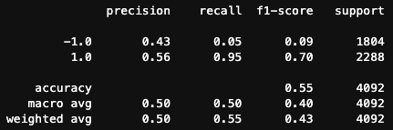
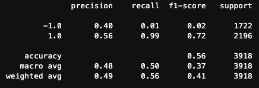
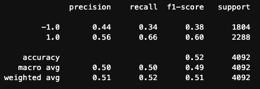
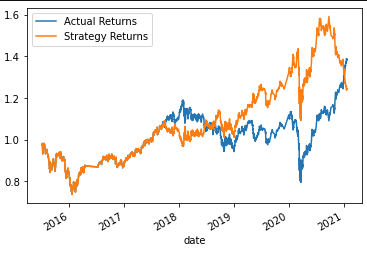

# Fintech-Challenge_14
Module 14 Challenge

# Module 14 Algorithm

## Challenge: Algorithmic Trading Bot

In this Challenge, you’ll assume the role of a financial advisor at one of the top five financial advisory firms in the world. Your firm constantly competes with the other major firms to manage and automatically trade assets in a highly dynamic environment. In recent years, your firm has heavily profited by using computer algorithms that can buy and sell faster than human traders.

The speed of these transactions gave your firm a competitive advantage early on. But, people still need to specifically program these systems, which limits their ability to adapt to new data. You’re thus planning to improve the existing algorithmic trading systems and maintain the firm’s competitive advantage in the market. To do so, you’ll enhance the existing trading signals with machine learning algorithms that can adapt to new data.

     

#

---

## Technologies

*The technologies required for the program to run are as follows:*

### Languages:   

### [Python](python.org)

### Import the required libraries and dependencies

>`pandas`           https://pandas.pydata.org/

>`numpy`            https://numpy.org/

>`pathlib`          https://docs.python.org/3/library/pathlib.html

>`hvplot`           https://hvplot.holoviz.org/

>`matplotlib`       https://matplotlib.org/

>`sklearn`          https://scikit-learn.org/stable/

---

## Usage

* This challenge consists of three technical deliverables. You will do the following:

      * Implement an algorithmic trading strategy that uses machine learning to automate the trade decisions.

      * Adjust the input parameters to optimize the trading algorithm.

      * Train a new machine learning model and compare its performance to that of a baseline model.

>
> Available at:
https://courses.bootcampspot.com/courses/1251/assignments/25277?module_item_id=511889

## Results

* The followig results from the baseline model, tuned model, and new machine learning model are as follows:
  * Baseline Model
    * Short = 3 
    * Long = 100
    * 3 Month Window
      * This model produced similar results to the new model that I chose to use linear regression.  This baseline model had a recall of .95 for the 1.0 signal. 
      * 
  
  * Tuned Baseline Model
    * Short = 12 
    * Long = 120
    * 6 Month Window
      * This was the best performing model with a recall of .99 for the 1.0 signal. 
      * 
  
  * New Model
    * Short = 3 
    * Long = 100
    * 3 Month Window
      * This new model using linear regression performed the worst of the 3 with a recall of .66 for the 1.0 signal. 
      * 
  * New Model Plot
      * 

## Contributors

Scott J. Marler

> ### LinkedIn Profile:     [https://www.linkedin.com/in/scott-marler-212040b6/](https://www.linkedin.com/in/scott-marler-212040b6/)

---

## Licenses

> [GNU General Public License v3.0](COPYING.txt)
